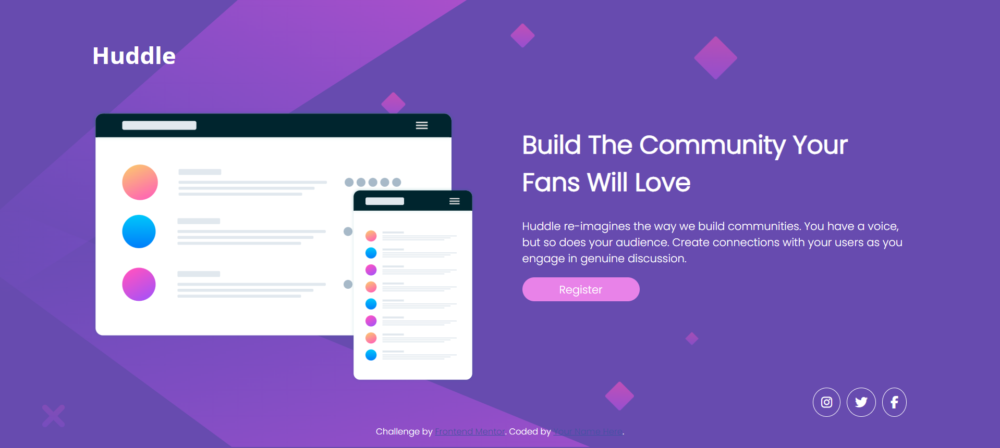

# Frontend Mentor - Huddle landing page with single introductory section

## Welcome! 👋

This is a solution to the [Huddle landing page with single introductory section challenge on Frontend Mentor](https://www.frontendmentor.io/challenges/huddle-landing-page-with-a-single-introductory-section-B_2Wvxgi0).

## Table of contents

- [Overview](#overview)
  - [The challenge](#the-challenge)
  - [Screenshot](#screenshot)
- [My process](#my-process)
  - [Built with](#built-with)
  - [What I learned](#what-i-learned)
  - [Useful resources](#useful-resources)

## The challenge

This challenge is to build out this landing page from the designs provided in the starter code. Goal of this challenge is user should be able to: 

- View the optimal layout for the page depending on their device's screen size
- See hover states for all interactive elements on the page

### Screenshot

## My process

### Built with

- Semantic HTML5 markup
- CSS custom properties
- Flexbox

### What I learned

I learned how to style and build out web with flexbox. This challenge is very suitable for beginners who want to apply HTML and CSS to real project. 

### Useful resources

- [Resource 1](https://www.w3schools.com/css/) - This helped me for understanding and providing examples of how to apply CSS tools.
- [Resource 2](https://developer.mozilla.org/en-US/docs/Web) - This is an amazing web to selftaught html and css. 

